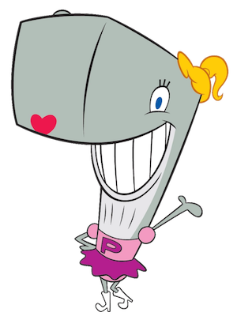

# Pearl The Whale
[](https://travis-ci.org/CosasDePuma/PearlTheWhale) [](https://www.docker.com/community-edition) 


:vhs: Clone me!
----
Clone or download the Github project
```bash
git clone https://github.com/cosasdepuma/pearlthewhale.git PearlTheWhale
```


:hammer: Compilation
----
You can create compile all the Dockerfiles with the following command:

```bash
docker build --tag somename folder
```

For example:
```bash
docker build --tag cosasdepuma:searchsploit searchsploit/
```


:computer: Not in my computer!
----
> If you don't want to install Docker in your computer, you can [Play With Docker](labs.play-with-docker.com) online.


:busts_in_silhouette: Members
----

| Name | Position | Contact |
| ------ | ------ | ------ |
| Kike Puma | Creator & Developer | [LinkedIn](https://linkedin.com/in/kikepuma) |


:octopus: Support the developer!
----
Everything I do and publish can be used for free whenever I receive my corresponding merit.

Anyway, if you want to help me in a more direct way, you can leave me a tip by clicking on this badge:

<p align="center">
    </br>
    <a href="https://www.paypal.me/cosasdepuma/"></img></a>
</p>


:earth_africa: Scheme of contents
----
```
PearlTheWhale
 < Repository >
|__ .repository
|__ .gitignore
|__ LICENSE
|__ README.md
 < CI/CD >
|__ .travis.yml
< Dockerfiles >
|__ Dockerfiles
  |__ searchsploit
```


Please contact with [Kike Puma](https://linkedin.com/in/kikepuma) if you need more information.
